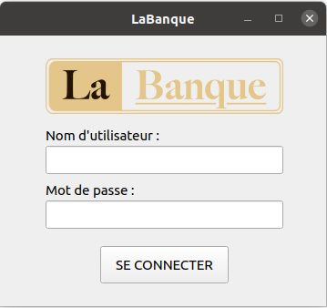
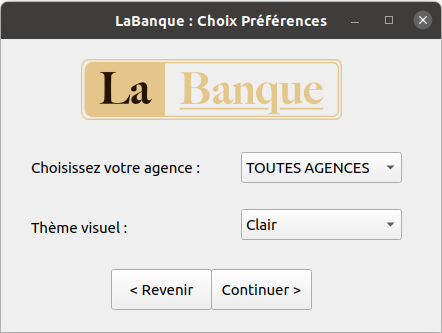
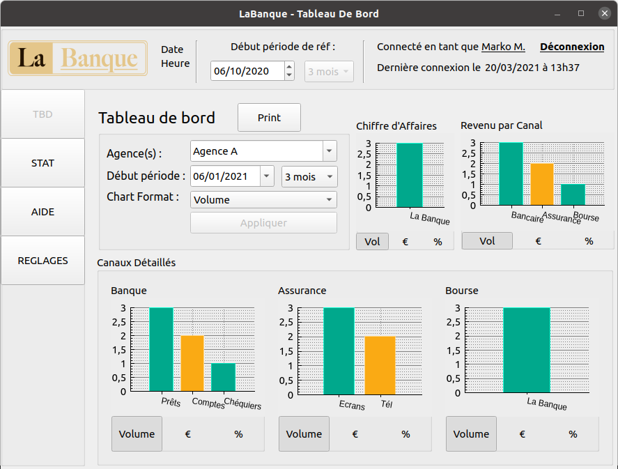
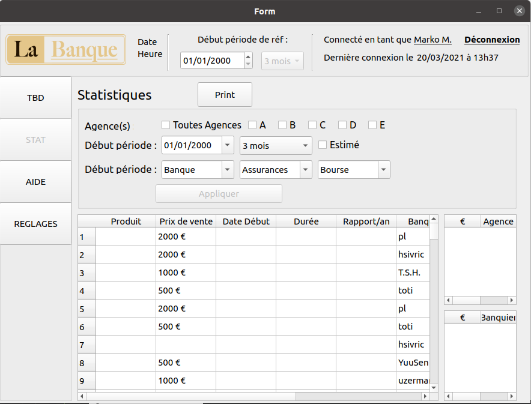

# Git du projet IHM avril 2021 Univ. de Strasbourg

## Pré-requis :

- QT 5.14.1 (aucune compatibilité n’a été vérifiée avec d’autres versions que
celle-ci)

## Get quickly Started :
1. Télécharger le projet
2. Ouvrir le fichier sources/LaBanque.pro avec QT 5.14.1

## Intro

Dans le cadre de l’Unite d’Enseignement Interactions Homme-Machine (IHM)
en troisième année de Licence d’Informatique à l’Université de Strasbourg, nous
devons réaliser une interface utilisateur pour la célèbre entreprise fictive du secteur bancaire, sobrement nommée " La Banque ".

Les employés de La Banque utiliseraient notre logiciel pour avoir un compte
rendu de vente trimestriel (pour chaque Comité Directeur), mais également pour
voir la performance des différents banquiers.

Voici quelques screens de l'application :

